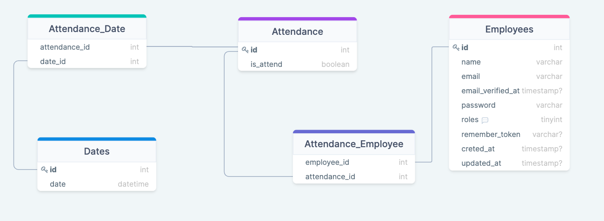

## Simple HR Module

## How to use it
- clone the repository with `git clone`.
- copy environment variables using `cp .env.example .env` and edit database credentials there.
- run `composer install` to install the dependencies.
- run `php artisan key:generate` to generate the key for the project.
- run `php artisan migrate --seed`, because it has some seeded data for testing.

### Admin credentials

- **in the login page**
    - email: `admin@company.com`
    -  password: `admin123password`

### HR credentials

- **in the login page**
    -   email: `hr@company.com`
    -   password: `hrpass123`

### this is my Database Schema

.

for more information about the database schema, please visit this [link](https://drawsql.app/6b19da86bc/diagrams/simplehrmodule).

This is part of the BlackGem Tech task.

**Unfortunately**, I couldn't complete the project because of the shortage of time. I hope that the first steps I put in this
project would give you some thoughts about my technical skills.
